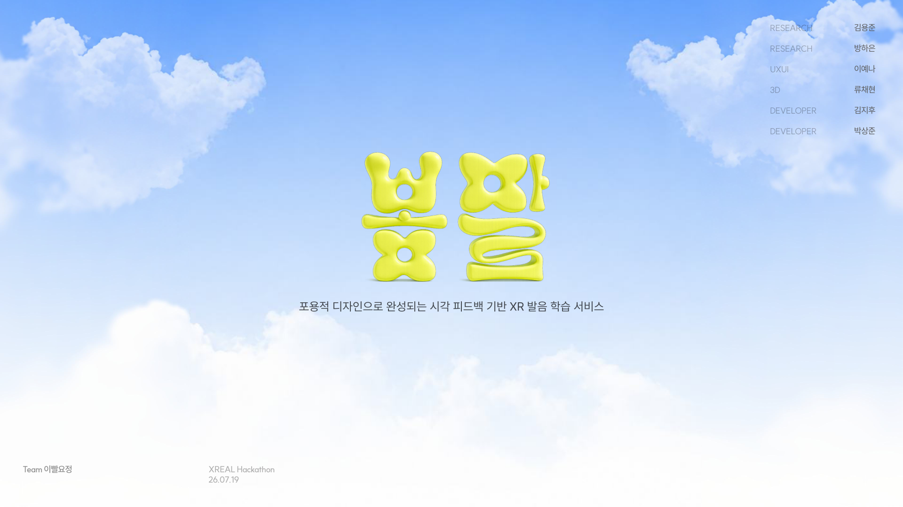
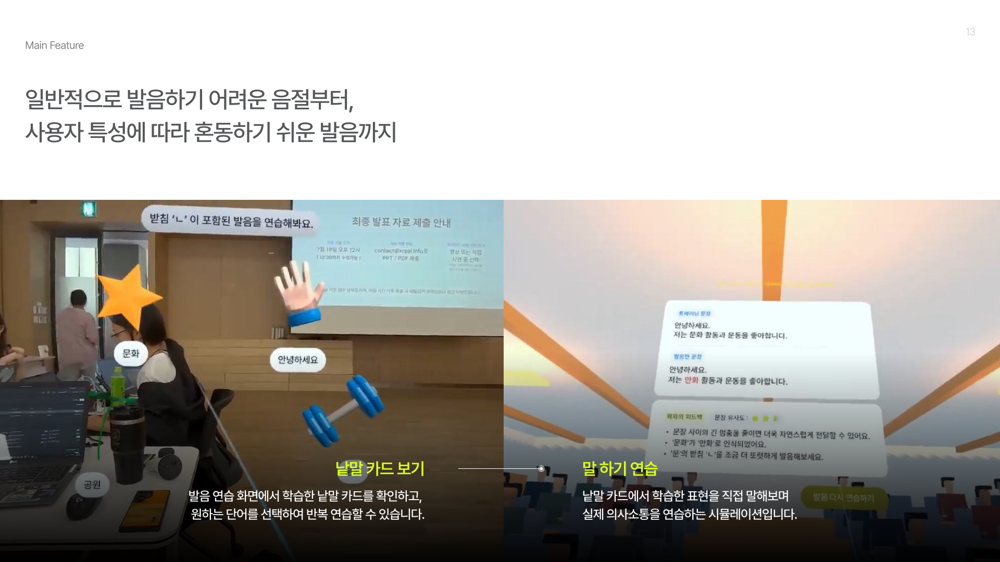
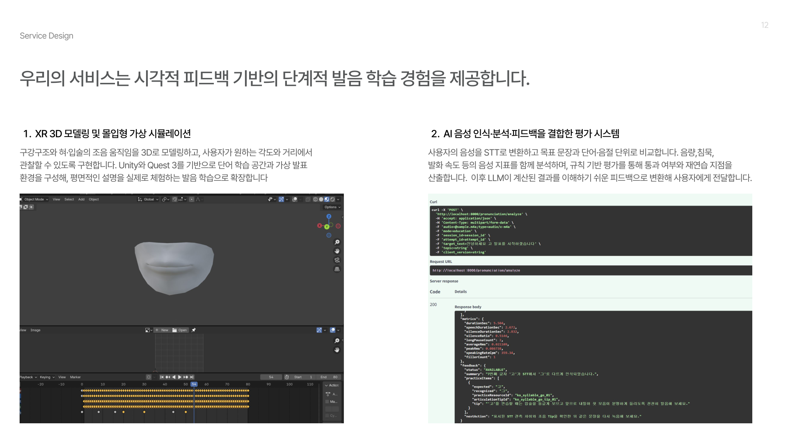
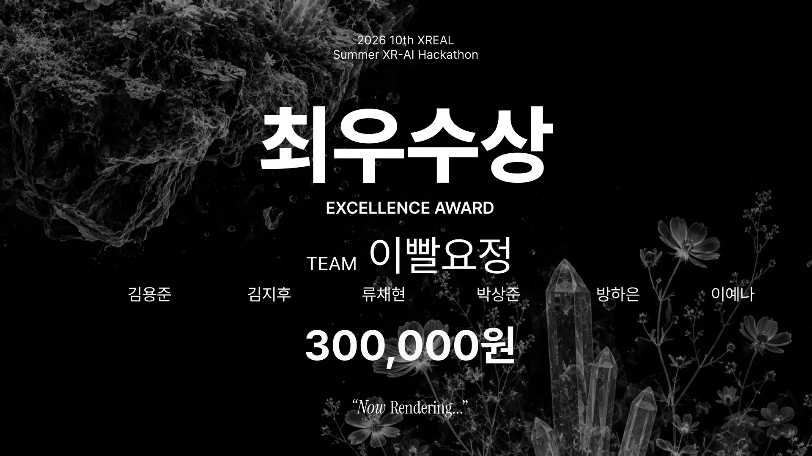

# 봄말 (Bommal)

**포용적 디자인으로 완성되는 시각 피드백 기반 XR 발음 학습 서비스**

> 🏆 **2026 10th XREAL Summer XR-AI Hackathon 최우수상 (Excellence Award)** — Team 이빨요정
> 주제: *XR-AI for Public Good* · 2026.07.18 – 07.19 (1박 2일) · 서울창업허브 엠플러스



## 시연 영상

https://github.com/user-attachments/assets/b3c0afdd-a483-41b4-8bed-1efe4c5252d8

## 어떤 문제를 풀었나요?

청각장애인은 **자신의 발음이 상대에게 어떻게 들리는지 스스로 확인하기 어렵습니다.**
이 불확실성은 말하기 전의 불안과 의사소통 위축으로 이어집니다.

봄말은 소리 대신 **눈으로 보는 피드백**으로 발음을 교정할 수 있게 합니다.
Meta Quest 3 패스스루 환경에서 입 모양을 3D로 보여주고, AI가 사용자의 발음을 분석해 무엇이 다르게 들렸는지 알려줍니다.

- **Main Target**: 발화는 가능하지만 청각적 피드백을 통해 스스로 발음을 교정하기 어려운 사람
- **Sub Target**: 후천적 청력 저하 이후 발음의 명료도가 낮아진 사용자

## 주요 기능



### 1. 낱말 카드 연습 (`1. PracticeRoom`)
1. 이름 입력 후 연습 시작
2. 공중에 떠 있는 낱말 카드(예: 받침 `ㄴ`이 들어간 "문화") 중 하나를 선택
3. **3D 입 모양 애니메이션**으로 올바른 발음을 눈으로 확인
4. 마이크로 직접 발음 → AI 서버가 분석해 정답/재시도 판정
5. 틀리면 입 모양 예시를 다시 보여주고 재연습

### 2. 발표 시뮬레이션 (`2. PresentaionRoom`)
- 청중이 앉아 있는 가상 발표장에서 문장을 소리 내어 읽기
- 녹음 → 분석 → 피드백 화면에서 **목표 문장과 인식된 문장 비교**, 개선 팁 확인

## 시스템 구조



```
[Quest 3 / Unity]                               [AI 서버 (팀원 담당)]
 마이크 녹음 (16kHz WAV) ──multipart POST──▶  /pronunciation/api/v1/analyze
                                                STT → 목표 문장과 단어·음절 단위 비교
                                                음량·침묵·발화 속도 분석 → 규칙 기반 평가
 정답 판정 · 피드백 UI  ◀──────JSON───────────  LLM으로 이해하기 쉬운 피드백 생성
```

## 내 역할 — Unity 클라이언트 개발 & 빌드

AI 서버를 제외한 **Unity 앱 전반**을 개발하고 Quest 3용 APK 빌드를 담당했습니다.

- **XR 환경 구성**: XR Interaction Toolkit + Meta XR SDK 기반 Quest 3 앱, 연습 씬 패스스루(MR), 핸드 애니메이션, 텔레포트/레이 인터랙션
- **학습 흐름 UI**: 온보딩 → 낱말 선택 → 듣기 → 녹음 → 정답/오답 → 재시도 → 발표 준비로 이어지는 상태 흐름 (`PracticeUIFlowManager`, `OnboardingUIFlowManager`)
- **발표 시뮬레이션**: 청중 자동 배치(`PresentationAudienceGroup`), 녹음·로딩·피드백 흐름 (`PresentationUIFlowManager`)
- **AI 서버 연동**: 마이크 녹음 → WAV 인코딩 → 서버 요청 → 응답 파싱·정답 판정 (`QuestVoiceEvaluationDemo`, `VoiceResponseEvaluator`)
- **헤드셋 디버깅**: 콘솔을 볼 수 없는 기기 환경을 위해 마이크/STT 상태를 화면에 띄우는 오버레이 구현

## 기술 스택

| 분류 | 사용 기술 |
|---|---|
| Engine | Unity 6 (6000.3.9f1), URP 17.3 |
| XR | XR Interaction Toolkit 3.3, OpenXR 1.16, Meta XR SDK 203 |
| Device | Meta Quest 3 (Android) |
| Input | Unity Input System |
| 연동 | UnityWebRequest (multipart), JsonUtility |

## 프로젝트 구조

```
Assets/
├── Scenes/
│   ├── 1. PracticeRoom.unity        # 낱말 카드 연습
│   └── 2. PresentaionRoom.unity     # 발표 시뮬레이션
├── Scripts/
│   ├── OnboardingUIFlowManager.cs   # 이름 입력 / 시작 화면
│   ├── PracticeUIFlowManager.cs     # 연습 흐름
│   ├── PresentationUIFlowManager.cs # 발표 흐름
│   ├── PresentationAudienceGroup.cs # 청중 배치
│   ├── VoiceEvaluation/             # 녹음 · 서버 통신 · 판정
│   ├── Common/                      # 공용 유틸 (씬 탐색, 디버그 오버레이)
│   └── XR/                          # 핸드 애니메이션, 텔레포트
├── Model/                           # 3D 입 모양 · 캐릭터 모델
└── Editor/                          # 씬 구성 · Android 빌드 도구
```

## 실행 방법

1. Unity **6000.3.9f1**로 프로젝트 열기 (Android Build Support 필요)
2. `Assets/Scenes/1. PracticeRoom.unity` 실행
3. 음성 평가는 별도 AI 서버가 필요합니다. 씬의 `QuestVoiceEvaluationDemo` 컴포넌트에서 `Backend Base Url`을 서버 주소로 설정하세요.
   서버 없이 실행하면 녹음 후 오류 화면으로 넘어갑니다.

## 회고

- 1박 2일 안에 시연까지 완성하기 위해, 정해진 횟수를 시도하면 통과시키는 **시연 모드**를 넣었습니다. 실제 서비스라면 서버 판정만으로 흐름이 진행되어야 합니다.
- 해커톤 이후 중복된 UI·판정 코드를 공용 모듈로 분리하고, 매 프레임 로그를 남기던 테스트 코드를 제거하는 정리를 진행했습니다.

## Team 이빨요정

| 역할 | 이름 |
|---|---|
| Research | 김용준, 방하은 |
| UX/UI | 이예나 |
| 3D | 류채현 |
| Developer | 김지후, 박상준 |


